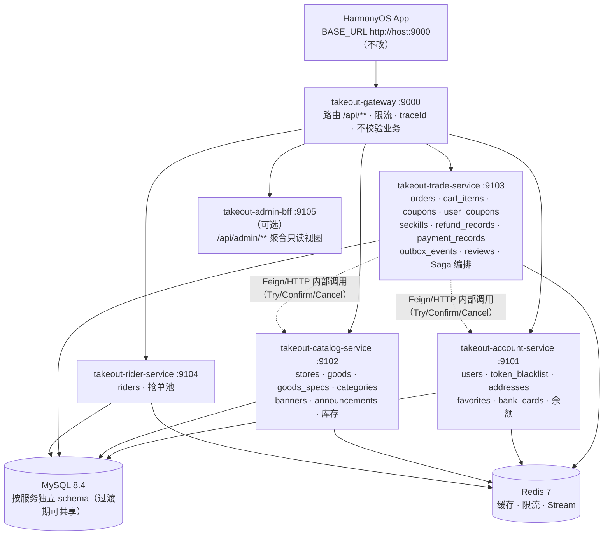

# 简单外卖 · 微服务与分布式落地 Spec

> **状态：评审通过 —— 已按「线 A + Phase 2/3」执行**（用户 2026-09 拍板：按推荐方案做线 A + Phase 2/3）
> **线 A（Phase 0）已完成并实测验收**，落地记录见本目录 `tasks.md` 勾选状态与 `checklist.md` 门禁记录。
> **依据**：`md/重构大纲提示词.md` 第 17 章 —— 以仓库现状为准、禁止推倒重来、冲突先列后改、一次只做一个可验证的小模块。

---

## 0.5 执行后的实测修正（落地时发现 Spec 与仓库现状有出入，以此处为准）

Spec 起草时基于静态阅读，Phase 0 落地时用工具实测校正了三处判断：

| # | Spec 原判断 | 实测结论 | 依据 |
| --- | --- | --- | --- |
| R1 | G3「定时任务多实例重复取消/重复退款」是正确性缺口 | **不是正确性缺口**。`OrderService.cancelPending` 早已是条件更新（`WHERE id = ? AND status = 0`），多实例并发也只会有一次成功。真实缺口仅是**重复扫描的浪费** | `OrderService.java` cancelPending 实现 |
| R2 | §2.1 与日志相关的描述（按天分文件等）为现状 | **仓库此前从未有 logback 配置**（`glob`/`grep`/`git log --all -- "*logback*"` 三路交叉均无）。AGENTS.md §4 的日志描述属文档漂移（源自 `TemporaryCacheStorage/sky-take-out` 参考项目）。G5 因此**必须自带 logback-spring.xml**，否则 MDC 里的 traceId 不会被打印 | 三个独立工具交叉验证 |
| R3 | 订单号替换存在"前端/接口兼容风险" | **零消费方风险**。前端 `orderNo` 仅作字符串展示、后端无按订单号查询的入口、测试零断言 | `grep -rn "orderNo" entry/` 与 `server/src` |

Spec 原有 G1/G2/G4/G5 判断与实测一致，按原计划落地。另新增两处 Spec 未预见的必要工作：**G3 的调度锁必须 fail-open**（Redis 不可用时放行，否则超时订单不再自动取消），以及**订单号唯一键冲突需换号重试一次**（Spec §3.6 只提到"加重试"，落地时明确了只针对 `order_no` 冲突、不掩盖其他唯一键错误）。

---

## 0. 一句话结论（请先看这段）

当前后端是一个 **"分布式就绪的单体"**：应用无状态、JWT 自包含、限流计数与热点缓存放在 Redis、领域事件走「事务性 Outbox + Redis Stream 消费组」、Docker Compose 一键编排。也就是说，**分布式能力已经有了一大半**，真正缺的是「多实例下的一致性收口」和「把单体拆成独立进程」。

因此本 Spec 分两条线，**建议按 A → 验收 → 再决定 B 走到哪**：

| 线 | 内容 | 风险 | 前端是否改动 | 能否中途停 |
| --- | --- | --- | --- | --- |
| **线 A：分布式基线收口** | 修掉"多实例才暴露"的 5 个缺口，让单体可真·水平扩展 | 低 | 零改动 | 可（A 本身就是一个完整交付） |
| **线 B：微服务化（Strangler 绞杀）** | 网关 + 领域服务逐步外拆，外部 `/api/**` 与 `:9000` 入口不变 | 中→高，逐阶段递增 | 零改动（网关保持契约） | 可在 Phase 2/3/4/5 任一处停 |

> **本 Spec 的诚实提醒**：完整微服务化（6 个服务 + Saga 分布式事务 + 分库）的工作量约为现有后端代码的 **1.5~2 倍**，且会触碰项目文档里明确标注为「风险较高」的 Saga/补偿领域（见 `md/Redis缓存与异步事件架构.md` §7）。对毕业设计而言，**线 A + Phase 2/3（网关 + 抽 1~2 个服务）就足以支撑"微服务与分布式"的答辩叙事**；线 B 的 Phase 4/5 属于"锦上添花，按时间决定"。

---

## 1. Why（动机与边界）

### 1.1 学理动机

毕设/答辩通常要求体现「微服务、服务治理、分布式事务、分布式缓存、消息驱动、高可用」这几类能力。逐项对照本项目现状：

| 能力 | 现状 | 本 Spec 归属 |
| --- | --- | --- |
| 分布式缓存（热点/穿透击穿雪崩） | ✅ 已落地 `HotDataCacheService` | 无需改动 |
| 消息驱动 / 事件解耦 | ✅ 事务性 Outbox + Redis Stream 消费组 | ✅ 已完成行级认领 |
| 服务无状态 / 水平扩展 | ✅ 设计上支持，多实例缺口已在相位 0 收口 | **线 A ✅ 已完成** |
| 分布式 ID | ✅ 雪花 `SnowflakeIdGenerator`（时间戳+workerId+序列号）+ 唯一键重试 | **线 A ✅ 已完成** |
| API 网关 | ❌ 无（单体直连） | 线 B Phase 2 |
| 服务注册与发现 | ❌ 无 | 线 B Phase 2（可选） |
| 配置中心 | ⚠️ 用环境变量 + yml，无集中配置 | 线 B Phase 6（可选） |
| 服务间调用 / 负载均衡 / 熔断 | ❌ 无 | 线 B Phase 3~5 |
| 分布式事务 | ❌ 现在是单体本地事务 | 线 B Phase 5（Saga/TCC） |
| 数据库分库（database-per-service） | ❌ 单库 takeout 全表 | 线 B Phase 3~5（渐进） |
| 分布式锁（用于调度，不用于防超卖） | ✅ 已落地 `SchedulerLock`（Redis，fail-open） | 线 A 已完成 |
| 链路追踪 / 可观测 | ✅ traceId 贯穿（`X-Request-Id` → MDC → logback pattern + 响应头） | 线 A 已完成 |
| 网关限流 / 熔断降级 | ⚠️ 服务内已有 Redis 限流 | 线 B Phase 2/6 |

### 1.2 明确不做（Out of Scope，防止过度工程）

以下均为**本 Spec 不引入**项，除非评审时你另行批准：

- ❌ RabbitMQ / RocketMQ / Kafka（沿用 Redis Stream；接口已抽象，`DomainEventPublisher` 可替换）
- ❌ Seata / 强一致分布式事务框架（改为业务可解释的 Saga + 补偿，见 Phase 5）
- ❌ Redis 分布式锁替代数据库条件更新来「防超卖」（`md/Redis缓存与异步事件架构.md` §1 已论证会变弱）
- ❌ 分库分表 / 读写分离 / 布隆过滤器 / 雪花以外的号段服务
- ❌ Kubernetes / 服务网格（Istio）。容器编排沿用 Docker Compose
- ❌ 前端任何改动（网关保证 `/api/**` 契约与端口 `:9000` 不变）
- ❌ 把 JdbcTemplate 全量迁移到 MyBatis-Plus（购物车已是 MyBatis-Plus，其余保持）

### 1.3 强制约束（来自仓库文档，落地时不得违反）

1. 以仓库现状为准；与现状冲突必须**先列冲突、说明兼容方案、等审核**（大纲 §17.1/§22.8）。
2. 禁止一次性推倒重来；每阶段一个可验证小模块，完成即跑构建/测试（大纲 §17.2）。
3. 未经确认不得删除已有页面、接口、数据库字段、测试账号、历史数据迁移逻辑。
4. 前端不得用假数据掩盖后端缺失（`AGENTS.md` §10）。
5. 只改文档时不改业务代码且不自动提交（`AGENTS.md` §9）。
6. 提交信息不得出现任何 AI 署名；身份固定 `HQYX2025 <751848863@qq.com>`（`AGENTS.md` §9）。

---

## 2. 现状盘点（可核实事实）

### 2.1 部署形态

- 单一后端进程 `takeout-server`，Spring Boot 3.5.4 / Java 25 / 端口 **9000**；`server/pom.xml` 为单模块。
- 数据访问：`dao/`（JdbcTemplate）+ `mapper/`（仅购物车 MyBatis-Plus 3.5.12）。
- 编排：`docker-compose.yml` → `app` + `mysql:8.4`（宿主 3307）+ `redis:7`，带健康检查与启动顺序；`server/Dockerfile` 多阶段 JDK 25 构建。
- 前端入口固定：`entry/.../common/Constants.ets` 的 `API_CONFIG.BASE_URL` 指向 `http://10.0.2.2:9000`，所有请求前缀 `/api`。

### 2.2 已经具备的分布式要素（复用它，不要重造）

| 能力 | 实现 | 证据文件 |
| --- | --- | --- |
| 应用无状态（JWT 自包含） | `JwtUtil` + `AuthInterceptor`，token 含 `jti`/`pwdAt` | `security/AuthInterceptor.java` |
| 登录态可吊销（跨实例一致） | `token_blacklist` 落 **数据库**（Redis 挂了登出也生效） | `dao/TokenBlacklistDao.java` |
| 分布式限流（跨实例共享计数） | Redis 计数 `takeout:rl:<action>:<id>`，Redis 不可用放行 | `security/LoginRateLimiter.java` |
| 热点缓存三防护 | 穿透空值占位 / 击穿 `SET NX` 回源锁 / 雪崩 TTL 抖动 | `service/HotDataCacheService.java` |
| 消息驱动（至少一次 + 幂等） | 事务性 Outbox → Redis Stream 消费组 → `setIfAbsent` 去重 | `service/mq/*`、`job/OutboxRelayJob.java` |
| 业务幂等 | 条件更新（`WHERE escrow_status=0` 等）+ 下单 `idempotencyKey`（Redis SET NX）+ 秒杀唯一键 | `OrderService`、`SeckillDao` |
| 一键编排 | Compose + 健康检查 + 启动依赖顺序 | `docker-compose.yml` |

### 2.3 阻碍「真·多实例 / 微服务化」的事实（本 Spec 要解决的）

| # | 缺口 | 位置 | 多实例下的后果 |
| --- | --- | --- | --- |
| G1 | Outbox 中继 `listPending` 单实例行锁，多实例会重复搬运 | `dao/OutboxEventDao.java`（有 ponytail 注释） | 事件被重复投递（消费端去重能兜底，但浪费且放大延迟） |
| G2 | 消费者名固定 `consumer-1` | `service/mq/DomainEventConsumer.java` | 多实例同名消费者互相抢消息，无法各自消费 |
| G3 | 定时任务（超时取消、Outbox 清理）无单实例约束 | `job/OrderTimeoutJob.java`、`OutboxRelayJob` | 多实例同时扫描，重复取消/重复清理（大多幂等，但要显式化） |
| G4 | 订单号 = 时间戳 + 4 位随机数 | `OrderService` | 高并发碰撞 → 唯一键冲突失败（已有 UNIQUE 兜底但无重试） |
| G5 | 无 traceId 贯穿、无跨进程调用 | 日志层 | 拆服务后无法定位一次请求跨了几个服务 |
| C1 | 跨域强耦合：`OrderService.createOrder` 一个本地事务内同时写 订单/库存/秒杀名额/优惠券/余额 | `service/OrderService.java` | 拆服务时这里必然变成分布式事务（Phase 5 的核心难点） |
| C2 | 共享单库 `takeout` 全表，跨域 JOIN | 各 DAO | 分库后 `AdminStatsDao`、推荐/搜索等跨域查询需改写为 API 组合 |
| C3 | `/uploads/**` 由应用本地磁盘提供 | `UploadController` + compose `uploads-data` 卷 | 多实例/多服务下必须共享卷或对象存储 |

> 说明：`AGENTS.md` 记 169 个后端测试、`README.md` 记 151 个，两处口径不一致；本 Spec 不引用具体数字，各阶段验收一律以实际 `mvn -f server/pom.xml test` 输出为准。

---

## 3. 目标架构

### 3.1 目标拓扑（线 B 终态；Phase 2~5 逐步逼近）



### 3.2 服务边界与路由归属（**外部 API 不变**，这是本方案的关键收益）

| 服务 | 拥有的表 | 承接的现有路由 |
| --- | --- | --- |
| `gateway` :9000 | 无 | 全部 `/api/**` 反向代理（按前缀路由） |
| `account-service` | `users`、`token_blacklist`、`addresses`、`favorites`、`bank_cards` | `/api/auth/**`、`/api/addresses/**`、`/api/favorites/**`、`/api/assistant/**`（读用户/订单数据时经 BFF 或 Feign） |
| `catalog-service` | `stores`、`goods`、`goods_specs`、`categories`、`banners`、`announcements` | `/api/categories`、`/api/stores/**`、`/api/goods/**`、`/api/rankings/**`、`/api/banners`、`/api/announcements`、`/api/search`、`/api/merchant/stores|goods|categories/**` |
| `trade-service` | `orders`、`cart_items`、`coupons`、`user_coupons`、`marketing_activities`、`seckills`、`seckill_orders`、`reviews`、`refund_records`、`payment_records`、`outbox_events` | `/api/orders/**`、`/api/cart/**`、`/api/coupons/**`、`/api/seckills`（名额占用）、`/api/merchant/orders/**`、`/api/merchant/stats`、`/api/merchant/reviews/**`、`/api/admin/refunds/**` |
| `rider-service` | `riders` | `/api/rider/**`、`/api/admin/riders/**` |
| `admin-bff`（可选） | 无（只读聚合） | `/api/admin/**` 的跨域统计/列表聚合 |
| `upload` | 本地卷/对象存储 | `/api/upload`、`/uploads/**`（G3 共享卷，或放 catalog/account 之一） |

**边界原则**：
- 一个表**只属于一个服务**，其他服务只能通过接口访问，禁止跨库 JOIN（过渡期例外，见 3.5）。
- 「交易域」（订单+支付+托管+退款+券核销+秒杀名额）放在 `trade-service`，因为它们在业务上必须原子；这是刻意合并，避免把最难的分布式事务摊到 4 个服务。
- 余额（`users.balance`）归属 `account-service`，支付时通过 **TCC** 与 `trade-service` 协作（Phase 5）。

### 3.3 服务注册、发现与配置

| 项 | 默认方案（低风险，推荐） | 可选方案（需兼容性验证） |
| --- | --- | --- |
| 路由/负载均衡 | 网关静态路由指向 Compose 服务名（`http://catalog-service:9102`），Compose 内 DNS 即"发现" | Nacos / Eureka + `lb://` 动态发现 |
| 配置 | 各服务独立 `application.yml` + 环境变量（沿用现有 `TAKEOUT_*` 约定） | Spring Cloud Config / Nacos Config |
| 版本线 | Spring Cloud **2025.0.x（Northfields）** 为 Boot 3.5 对应线 | — |

> ⚠️ **Phase 2 必须先做兼容性冒烟**：Java 25 + Spring Boot 3.5.4 + Spring Cloud 2025.0.x + Spring Cloud Gateway。已知风险点：Spring Cloud Alibaba/Nacos 在 2025.0.x 存在配置刷新相关 issue（alibaba/spring-cloud-alibaba #4331），且 SCA 对 Boot 3.5/Java 25 的支持需实测。**若 Nacos 不通过，就退回"静态路由 + 环境变量"，不要为了注册中心牺牲可构建性。**

### 3.4 服务间通信与容错

- 同步调用：Spring Cloud OpenFeign（或 Boot 自带 `RestClient`）；仅用于**必须实时**的校验/预占（价格、库存、余额、券）。
- 异步：沿用 Redis Stream + Outbox（通知类、统计类、下游动作）。
- 内部接口约定：统一前缀 `/internal/**`，**不对外暴露**（网关不路由 `/internal`；服务间加 `X-Internal-Token` 头校验，值由环境变量注入）。
- 容错：Resilience4j 熔断 + 超时 + 有限重试；**所有被调用方接口必须幂等**（带 `sagaId`/`requestId`），否则重试会重复扣减。
- 降级口径（与现有"Redis 挂不升级为业务故障"一致）：catalog 不可用时下单**明确失败**（不能卖不知价格的货），浏览类接口返回缓存或可读错误——**绝不用假数据兜底**。

### 3.5 数据策略（渐进分库，不搞大爆炸）

| 阶段 | 数据形态 | 说明 |
| --- | --- | --- |
| 过渡（Phase 2~3） | 所有服务仍连**同一个 `takeout` 库** | 零数据迁移、测试不失效；服务边界靠代码纪律约束 |
| 独立（Phase 4~5） | 每服务独立 schema：`takeout_account` / `takeout_catalog` / `takeout_trade` / `takeout_rider` | 一次性迁移脚本 `scripts/migrate-db-per-service.sql` + 回滚脚本；同 MySQL 实例即可（毕设够用） |
| 跨域查询改写 | `AdminStatsDao`、搜索/推荐 | 改为 API 组合（`admin-bff` 聚合）或 trade/catalog 各自暴露内部只读接口 |

### 3.6 分布式 ID

- 引入 `takeout-common` 内的 **Snowflake** 生成器（workerId 从环境变量/宿主机名派生，避免多实例撞号）。
- 订单号 `order_no` 改用雪花（字符串化），保留 `orders.order_no UNIQUE` 兜底 + **冲突重试 1 次**。
- 与现有 `items` JSON 快照、前端订单号展示兼容（前端只当字符串）。

### 3.7 分布式事务（Phase 5 核心）

下单/支付跨 `trade`（订单/券/秒杀）与 `catalog`（库存）、`account`（余额），采用 **编排式 Saga + TCC 型预留**：

```
createOrder(sagaId):
  1) trade 本地事务：写 order(status=0) + 券/秒杀 Try + 写 saga 记录 + 写 outbox
  2) catalog  /internal/stock/reserve      (Try：条件更新扣减为预留)
  3) 任一步失败 → 逆序补偿 release（幂等，按 sagaId 去重）
  4) 返回订单详情（外部契约与今天完全一致）

payOrder(sagaId):
  1) account  /internal/balance/freeze     (Try：冻结)
  2) trade    条件更新 status 0→1
  3) account  /internal/balance/confirm    (Confirm：实际扣减)
  4) 失败 → account /internal/balance/cancel（解冻）+ trade 回滚状态
```

- 新增表：`saga_transactions`（sagaId 主键、业务类型、状态、各步结果、重试次数、创建/更新时间）。
- **Saga 恢复任务**：定时扫描未完成 Saga，幂等重试/补偿（多实例安全，见 Phase 0 的调度锁）。
- **关键纪律**：所有 Try/Confirm/Cancel 必须条件更新 + 幂等键；事件仍在**条件更新成功之后**发布（沿用现有规则）。
- 现有单体本地事务行为在 Phase 5 之前**保持不动**；Phase 5 需为每条路径写"先红后绿"用例（含补偿必失败再修回）。

### 3.8 可观测性与安全

- 每个服务暴露 Actuator `/actuator/health`、`/actuator/metrics`；Compose 健康检查复用 `server/docker/healthcheck.java`。
- `X-Request-Id`/`traceId`：网关生成并透传，各服务日志 MDC 打印；可选 Micrometer Tracing + Zipkin（Phase 6）。
- 安全：JWT 校验**仍由各服务通过 `takeout-common-security` 完成**（自包含 token，共享密钥），网关**不**把鉴权变成唯一防线；`/internal/**` 加内部 token 且不对外路由。

---

## 4. 分阶段实施计划（每阶段独立可验收；前端零改动）

> 详细任务拆解见同目录 `tasks.md`；验收勾选项见 `checklist.md`。

### 线 A：分布式基线收口（**✅ 已完成并实测验收**）

- **Phase 0 — 多实例真·可用**（只改后端内部，接口零变化）—— **已完成**
  1. ✅ `OutboxEventDao.claimPending` 改 `SELECT ... FOR UPDATE SKIP LOCKED` 事务内行级认领 + `owner`/`lease_until` 租约（G1）。
  2. ✅ `DomainEventConsumer` 消费者名动态化 `consumer-<实例ID>`（G2）。
  3. ✅ 定时任务（OrderTimeout / Outbox cleanup）加 `SchedulerLock`（仅"单实例执行"用途，Redis 不可用时 fail-open；与"防超卖不用 Redis 锁"不冲突）（G3）。
  4. ✅ 雪花 ID 替换订单号生成 + `order_no` 唯一键冲突换号重试一次（G4）。
  5. ✅ traceId 贯穿：沿用/生成 `X-Request-Id` → MDC → 回写响应头，并补 `logback-spring.xml`（pattern 含 `%X{traceId}`）。
  - **验收结果**（详见 §6.1）：全量 `mvn -f server/pom.xml test` **221 passed / 0 failed**（基线 182 + 新增 39）；真实 MySQL 8.4 上验证 SKIP LOCKED 行级认领不相交、租约四场景成立；「先红后绿」确认订单号用例能捕获旧实现的碰撞（旧实现同秒 200 单产出 199 个不同号）。

### 线 B：微服务化（Strangler，逐阶段可停）

- **Phase 1 — 逻辑边界收敛（不拆进程）** —— **已完成**：产出 `phase1-service-boundaries.md`（实测跨域 DAO 依赖矩阵 + 路由归属表）。**包结构整理刻意推迟到 Phase 2**，避免同一批文件改两遍。
- **Phase 2 — 网关 + 多模块骨架** —— **已完成**（详见 `phase2-gateway.md`）：`server/` 改 Maven 聚合（`takeout-parent` + `takeout-app` + `takeout-gateway`）；网关静态路由 `/api/**` 与 `/uploads/**`，**外部行为/端口/前端零变化**；全量 225 测试绿。
  - ✅ **兼容性冒烟通过**：Boot 3.5.4 + Java 25 + Spring Cloud **2025.0.3** + Gateway 4.3.5（编译 + Netty 启动 + 真实路由转发 200）。
  - ✅ **文档命令变更最小化**：`mvn -f server/pom.xml test` **命令不变**（聚合自动跑全模块）；仅 `spring-boot:run` 需加 `-pl takeout-app`。
  - ⚠️ **实测发现两个 Spec 未预见的安全缺陷**（已修复 + 契约测试守护）：
    ① 默认配置下网关**剔除** X-Forwarded-*（`trusted-proxies` 是正则非 CIDR）→ 后端只能看到网关 IP，**全站共用一个限流桶**；
    ② `for-append=true` 时客户端**伪造 XFF** 排在最前，后端取 `split(",")[0]` → **无限绕过登录限流**。已改为覆写语义。
- **Phase 3 — 抽 `catalog-service`（收益最大、耦合最小）**：迁移 stores/goods/specs/categories/banners/announcements 及其缓存；网关把对应前缀路由过去；**过渡期共享 `takeout` 库**。
  - **验收**：`rider-chain-regression.ps1` 全绿（订单需调 catalog 取价/扣库存）；前端 HAP 不重新构建也能正常浏览下单。
- **Phase 4 — 抽 `account-service`**：users/auth/token_blacklist/addresses/favorites 迁移；balance 暂留，或一并迁移并进入 Phase 5 的 TCC。
- **Phase 5 — 抽 `trade-service` + Saga/TCC（最难，可放弃）**：orders/cart/coupons/seckills/refunds/payment 迁移；实现 §3.7 的 Saga；分库到独立 schema。
  - **验收**：下单/支付/取消/退款/超时取消五条路径的 Saga 用例（含补偿、幂等、并发重复）"先红后绿"；资金口径与现有托管语义完全一致。
- **Phase 6（可选）— `rider-service` + `admin-bff` + 治理收口**：注册中心/配置中心（若 Phase 2 已验证）、网关限流、Resilience4j 熔断、Tracing/Zipkin、跨域统计 API 组合。

---

## 5. 关键设计决策与取舍

| # | 决策 | 取舍理由 |
| --- | --- | --- |
| D1 | 外部契约与端口 `:9000` 保持不变，前端零改动 | 前端是 HarmonyOS 单 HAP，改 BASE_URL 会连带真机联调/上架；网关兜住契约风险最低 |
| D2 | 采用 Strangler 渐进拆分，不重写 | 遵守大纲 §17.2；每阶段可停、可回滚 |
| D3 | 交易域（订单+券+秒杀+支付+退款）合并在一个服务 | 避免把"必须原子"的核心拆成 4 处分布式事务；先降低 Phase 5 的爆炸半径 |
| D4 | 余额 TCC、库存/券 Saga 预留，不引入 Seata | 代码可解释、可测试、可写进论文；避免重中间件与黑盒 |
| D5 | 过渡期共享库，后期分 schema | 共享库能保住现有全部测试与零迁移；分库单独做迁移脚本与回滚 |
| D6 | 注册中心"可选、需实测" | Boot 3.5/Java 25 下 SCA/Nacos 存在兼容风险；静态路由已能演示服务化 |
| D7 | 网关只路由/限流/traceId，鉴权仍由各服务校验 | 保持现有 `AuthInterceptor` 唯一认证入口语义，不弱化安全 |
| D8 | 分布式锁只用于定时任务单实例，不用于防超卖 | 与 `md/Redis缓存与异步事件架构.md` §1 既有论证一致 |
| D9 | 每阶段完成即 `mvn test` + 真实链路脚本验收 | 遵守"一次一个可验证小模块" |

### 5.1 与仓库现状的冲突清单（大纲 §17.1/§22.8 要求：先列后改）

| # | 冲突 | 现状 | 本 Spec 的兼容方案 | 需你批准 |
| --- | --- | --- | --- | --- |
| X1 | 大纲 §17.1「不批准强制迁移/引入…，只有用户批准才允许落地」 | 未引入 Spring Cloud/网关 | 明确列出新增依赖栈，等评审批准后再加 | ✅ 是 |
| X2 | `md/Redis缓存与异步事件架构.md` §7 与 `createOrder` 单事务决策 | 下单保持同步本地事务，Saga 标注"风险较高" | 线 A/Phase 2~4 不动下单；Phase 5 才引入 Saga，且单独评审 | ✅ 是（仅 Phase 5） |
| X3 | `AGENTS.md` 构建命令 `mvn -f server/pom.xml spring-boot:run` | 单模块 | 多模块后 `test` 命令**保持不变**（聚合自动跑全模块），仅 `spring-boot:run` 改 `-pl takeout-app`；已同步 `AGENTS.md` | ✅ 已批准并落地 |
| X7 | 网关 XFF 信任边界（**实测新增，Spec 未预见**） | 无网关时 `clientIp()` 读客户端直连地址 | 网关必须 `for-append: false`（覆写）+ `trusted-proxies` 匹配直连地址；否则限流失效或可被绕过 | ✅ 已修复 + 契约测试 |
| X8 | `Dockerfile` 的 `COPY pom.xml`/`COPY src` 路径 | 单模块布局 | 多模块后改为双 jar 镜像 + 正确的模块路径；compose 增 `gateway` 服务，对外 9000 由网关暴露 | ✅ 已落地 |
| X4 | `/uploads/**` 应用本地磁盘 | Compose 命名卷 | 多实例下共享同一卷；拆服务时明确归属或迁对象存储 | 提示 |
| X5 | 多实例 Outbox 认领 | 文档已留 ponytail 升级路径 | Phase 0 直接实现 `SKIP LOCKED` | 否（既定方向） |
| X6 | 购物车 MyBatis-Plus、其余 JdbcTemplate 并存 | `AGENTS.md` 已授权 | 保持不变，不借机迁移 | 否 |

### 5.2 需要你拍板的选项（评审时回答）

**已拍板（用户 2026-09 确认：按推荐方案做线 A + Phase 2/3）**：

1. **目标范围** → **线 A + Phase 2/3**（网关 + 抽 catalog；答辩够用）。Phase 4/5 视时间决定，不在本次承诺范围。
2. **注册中心/配置中心** → **静态路由**（默认、低风险）；Nacos 仅在 Phase 2 兼容性冒烟通过后才考虑。
3. **分库时机** → **过渡期共享单库**（保住现有全部测试与零迁移）。
4. **分布式事务** → **Saga + TCC**（仅当做到 Phase 5 时启用，本次不在范围）。
5. **订单号** → **雪花 ID**（已落地）。

---

## 6. 验收标准

### 6.1 线 A 整体验收（**已执行，记录实测结果**）

- **Requirement:** 后端 SHALL 支持多实例同时运行且不产生重复业务副作用。
  - **Scenario:** 两实例并发认领 Outbox 事件
    - **WHEN** 两个事务同时对 `outbox_events` 执行行级认领
    - **THEN** 各自拿到**不相交**的事件集合
    - **✅ 实测（MySQL 8.4.0，非 mock）**：会话 A 持锁时 SELECT 到 `{1,2,3}`；同一时刻会话 B 的 SKIP LOCKED 查询拿到 `{4,5,6}` —— 无重叠、无空等。
  - **Scenario:** 认领后实例崩溃
    - **WHEN** 已认领的行未 markSent / markRetry
    - **THEN** 租约未过期时其他实例认领不到（防重复投递）；租约过期后可重新认领（事件不丢失）
    - **✅ 实测**：`lease_until=9999999999999` 时该行对其他实例不可见（cnt=0）；`lease_until=1` 时可被重新认领（cnt=1）；`markRetry` 后 `owner=''`、`lease_until=0`、`retry_count+1`，任意实例可立即接手；`status=1` 的行永不再被认领（cnt=0）。
  - **Scenario:** 订单号并发
    - **WHEN** 同一秒内并发创建订单
    - **THEN** `order_no` 全局唯一
    - **✅ 实测（先红后绿）**：旧实现（秒级时间戳 + 4 位随机数）在同秒 200 单下产出 **199 个不同订单号**（1 次碰撞，用例 RED）；换雪花后 200 单全不相同（GREEN）。雪花生成器另有 16 线程 × 2000 = **32000 个 ID 零重复**的并发验证。
  - **Scenario:** 调度锁降级
    - **WHEN** Redis 不可用或抛异常
    - **THEN** 定时任务**仍然执行**（fail-open），不因一把锁让超时订单不再取消
    - **✅ 实测（单测）**：`SchedulerLockTest` 7 用例，覆盖抢到锁执行 / 未抢到跳过 / Redis 为 null 放行 / Redis 抛异常放行 / 动作异常传播 / 开关关闭直执行 / 不同任务锁键隔离。
  - **Scenario:** traceId 贯穿
    - **WHEN** 一次请求经过拦截器
    - **THEN** 上游带则沿用、没带则生成；值进 MDC（logback pattern 打印）并回写响应头；请求结束清理 MDC
    - **✅ 实测（单测）**：`TraceContextTest` 7 用例 + `ApiRequestLoggingInterceptorTraceTest` 7 用例，含控制字符剥离（防日志注入）、连续请求不串 traceId、异常路径也清理。
  - **Scenario:** 全量回归
    - **✅ 实测**：`mvn -f server/pom.xml test` → **Tests run: 221, Failures: 0, Errors: 0, Skipped: 0**，BUILD SUCCESS（基线 182 + 新增 39，用例数上升）。

### 6.2 线 B 整体验收

- **Requirement:** 拆分过程 SHALL 对外部 API 契约与端口零破坏。
  - **Scenario:** 前端零改动
    - **WHEN** 完成 Phase 2/3/4/5 任一阶段
    - **THEN** 现有 HAP 不经重新构建即可完成浏览→下单→支付→接单→出餐→抢单→取餐→送达→确认收货，`scripts/rider-chain-regression.ps1` 全绿
- **Requirement:** 服务 SHALL 只通过接口访问他域数据。
  - **Scenario:** 越界检查
    - **WHEN** 执行边界检查
    - **THEN** 任一服务源码中不存在直接访问他域表/DAO 的引用（过渡期共享库时以代码纪律 + 检查脚本保证）
- **Requirement:** 下单/支付 SHALL 在跨服务失败时可补偿且幂等（Phase 5）。
  - **Scenario:** 库存预占后失败
    - **WHEN** 任一 Saga 步骤失败
    - **THEN** 已完成步骤被逆序补偿，订单状态与资金回滚到一致态，重放同一 sagaId 不重复生效
- **Requirement:** 每个阶段 SHALL 通过 `mvn -f server/pom.xml test` 且不减少现有用例。
  - **Scenario:** 回归
    - **WHEN** 阶段结束时执行全量测试
    - **THEN** 全部通过；新增契约/Saga 用例按"先红后绿"验证有效

---

## 7. 工作量与风险

| 阶段 | 预估工作量（相对工时） | 主要风险 | 回滚方式 |
| --- | --- | --- | --- |
| 线 A Phase 0 | 1x（最小） | 定时任务调度锁引入新故障面 | 关开关即可；纯内部改动 |
| Phase 1 边界收敛 | 1.5x | 边界划分争议 | 无运行时影响 |
| Phase 2 网关+多模块 | 2x | Spring Cloud/Java 25 兼容；构建命令变更 | 保留旧单体启动方式 |
| Phase 3 catalog | 3x | 库存/价格跨服务调用正确性 | 网关路由切回单体 |
| Phase 4 account | 3x | JWT/鉴权回归 | 路由切回 |
| Phase 5 trade+Saga | 5x（最大） | 分布式事务正确性、资金口径 | 该阶段独立分支，未达标不合并 |
| Phase 6 治理 | 2x | 中间件兼容 | 逐项独立开关 |

**总计**：做到 Phase 5 约 **17x**（即数倍于线 A）；这也是 §0 建议"线 A + Phase 2/3 先答辩"的原因。

---

## 8. Impact

- **Affected specs**：与 `production-ready`（部署/发布）、`complete-takeout-app`（业务闭环）衔接，不修改其内容。
- **Affected code（按阶段逐步，Phase 0 前不新增模块）**：
  - Phase 0：`dao/OutboxEventDao.java`、`service/mq/DomainEventConsumer.java`、`job/*.java`、`OrderService`（订单号）、`config/*`、`common/`（雪花、traceId）
  - Phase 1~6：新增 `server/takeout-common|gateway|account-service|catalog-service|trade-service|rider-service|admin-bff`；`server/pom.xml` 改聚合；`docker-compose.yml` 增服务；新增各服务 `schema`/迁移脚本
- **Affected docs**：新增本目录 spec/tasks/checklist；Phase 2 需更新 `AGENTS.md`/README 的构建与运行命令；Phase 5 需补 `md/微服务与分布式架构.md` 并登记 README 文档索引。
- **Affected tests**：现有测试在 Phase 4/5 分库时需按服务归位；新增服务边界契约测试与 Saga 用例。

## 9. 交付顺序建议（一句话）

**先做 Phase 0 并跑多实例验收 → 评审决定线 B 深度 → Phase 2 兼容性冒烟 → Phase 3 catalog → 视时间决定 4/5/6。** 任何阶段不达标就停在上一阶段，保持"永远可运行、前端永不受影响"。
