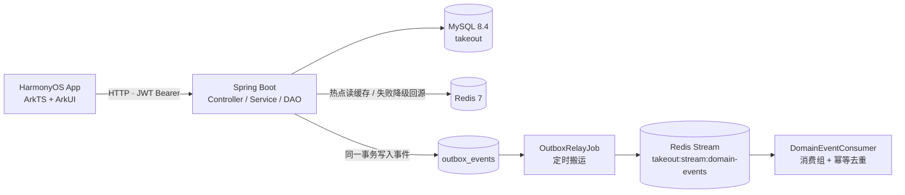

# 简单外卖 · simple-takeout

> HarmonyOS NEXT 外卖点餐 App（毕业设计 / 学习项目，业务对标美团外卖）。
>
> 前端为单 HAP 工程（ArkTS + ArkUI，API 26），后端为 Spring Boot 服务端（Java 25），
> 数据存储于 MySQL，热点数据缓存与领域事件使用 Redis，并提供 Docker Compose 一键环境。
>
> 覆盖**四端**：用户（点外卖）— 商户（接单出餐）— 骑手（抢单配送）— 平台管理。

## 功能特性

### 用户端（CUSTOMER）

- 首页分类导航、推荐/附近店铺列表、店铺与商品搜索、轮播 Banner 与公告
- 店铺详情、商品列表（分类分组、限时特惠、**多规格 SKU**）、收藏店铺
- **限时秒杀专区**、店铺/商品榜单、凑单推荐（还差多少元起送）
- 优惠券领取与下单核销（满减券按商品总价判断门槛）
- 购物车（服务端持久化，按账号隔离，按 `(goods_id, spec_id)` 区分规格）
- **结算下单（待付款模型）**：下单只占用库存/秒杀名额/优惠券并生成待付款订单，
  15 分钟内完成支付，超时自动取消并回滚占用
- 余额支付、订单跟踪、确认收货、图文评价（评价图片上传）
- 收货地址管理（含高德地图定位/选点、默认地址）
- 余额充值、个人资料编辑、联系客服、隐私政策、设置等

### 商户端（MERCHANT）

- 店铺资料维护、平台分类下开店
- 商品管理（增删改、上下架、库存、**多规格 SKU**、商户自定义分类、限时特惠标记）
- 订单处理：接单 → 制作 → 配送 → 送达，按状态推进订单
- 评价回复
- 营业额统计（仅统计已结算订单，区分待结算/已结算）

### 骑手端（RIDER）

- 上线 / 下线（仅在线可抢单）
- 待取餐订单池、抢单
- 取餐 → 送达，推进配送流程
- 个人资料，累计单量与收入

### 平台管理端（ADMIN）

- 独立后台：登录后直接进入管理页，不展示用户端首页/定位/购物车
- 平台分类管理、店铺审核（上下架/推荐）、全平台商品与用户管理
- 平台管理员（员工）账号管理
- **骑手管理**
- **内容管理**：轮播 Banner、公告
- 全平台订单查看与管理、经营统计（总览 + 订单趋势）
- 已送达订单的退款审批（同意退款 / 拒绝）

### 技术亮点

- **Redis 热点缓存**：缓存分类/店铺/商品/秒杀/榜单/Banner/公告等读多写少的浏览类数据。
  三类故障均有针对性防护——防**穿透**（不存在的对象写空值占位，短 TTL）、
  防**击穿**（回源前 `SET NX` 互斥锁，抢不到锁则降级回源而非阻塞）、
  防**雪崩**（TTL 叠加随机抖动）。**Redis 故障自动降级回源数据库，不影响主流程**。
- **领域事件异步化**：采用**事务性 Outbox** —— 事件与业务写入在**同一事务**落 `outbox_events` 表
  （要么一起提交、要么一起回滚，不会出现「幽灵事件」或「丢事件」），提交后由定时中继搬运到
  Redis Stream，消费组 + 去重键保证幂等。下单/支付/取消/退款事件异步驱动下游动作，
  **下单主流程保持同步事务**（防超卖依赖数据库条件更新的原子性）。
- **资金平台托管**：用户支付后资金 `escrow_status=0` 托管，确认收货后才结算给商户。
- **幂等与并发安全**：退款/结算用条件更新（`WHERE escrow_status=0`）防重复打款；
  库存/秒杀名额用乐观锁（`WHERE stock >= ?`、`sold + ? <= quota`）防超卖。
  **刻意不依赖 Redis 锁**：Redis 锁覆盖不到数据库写入，宕机时反而更弱。
- **容器化**：`docker compose up -d --build` 一条命令拉起后端 + MySQL + Redis（含健康检查与启动顺序）。

## 技术栈

| 端 | 技术 | 说明 |
| --- | --- | --- |
| 前端 | HarmonyOS NEXT · ArkTS（严格模式）+ ArkUI | `targetSdkVersion` / `compatibleSdkVersion` **26.0.0**，单 HAP；仅依赖 `@ohos/axios`，无第三方 UI 库 |
| 前端存储 | AppStorage + Preferences | 登录态、购物车展示等本地持久化 |
| 后端 | Spring Boot 3.5.4 · Java 25 | 分层 Controller / Service / DAO；JWT 认证（jjwt 0.12.6）+ 自定义拦截器（**未引入 Spring Security**） |
| 后端数据访问 | JdbcTemplate（购物车为 MyBatis-Plus 3.5.12） | `server/src/main/java/.../dao`、`mapper` |
| 数据库 | MySQL 8.4 | 库名 `takeout`；启动自动执行 `schema.sql`，`SchemaMigration` 兼容旧库，`DataSeeder` 填充种子数据 |
| 缓存 | Redis 7（Lettuce 连接池） | 热点浏览数据缓存；故障快速降级（500ms 超时 + 短连接超时） |
| 消息 | Redis Stream + 事务性 Outbox | 领域事件异步投递，**未引入 RabbitMQ/RocketMQ 等外部 MQ** |
| 容器化 | Docker · Docker Compose | 后端镜像基于 JDK 25 多阶段构建；MySQL 8.4 + Redis 7 |
| 地图 | 高德 Web 端 JS API v2.0 | 通过 ArkUI `Web` 组件内嵌运行，模拟器/真机均可用，无 native 依赖 |
| 测试 | JUnit 5（后端 **64 个**）、Hypium + hamock（前端） | `server/src/test`、`entry/src/test`（Local Unit）、`entry/src/ohosTest`（UI 自动化） |

## 系统架构



> 事件流的关键点：**事件先随业务事务落库**，再由中继异步搬运到 Stream。
> 中继**永不放弃投递**（事件已在库中，重试近乎零成本），因此 Redis 短暂故障不会导致事件丢失。

## 仓库结构

```
simple-takeout/
├── AppScope/                 # 应用级配置（bundleName: com.example.jiandanwaimai，应用名：简单外卖）
├── entry/                    # HarmonyOS App 模块（ArkTS 源码、页面、测试）
│   └── src/
│       ├── main/ets/
│       │   ├── entryability/ # EntryAbility
│       │   ├── pages/        # 用户端 / 商户端 / 骑手端 / 管理端页面
│       │   ├── components/   # 通用组件（确认弹窗、评分、状态时间轴等）
│       │   ├── service/      # HttpClient/ApiService、本地持久化、订单计算、定位等
│       │   ├── common/       # 常量（颜色、API 配置、订单状态文案等）
│       │   └── model/        # 数据模型
│       ├── test/             # Hypium 本地单元测试
│       └── ohosTest/         # UiTest 设备端自动化测试
├── server/                   # Spring Boot 后端（端口 9000）
│   ├── src/main/
│   │   ├── java/com/example/takeout/
│   │   │   ├── controller/   # 对外接口
│   │   │   ├── service/      # 业务（含 HotDataCacheService、service/mq 事件层）
│   │   │   ├── dao/ mapper/  # 数据访问
│   │   │   ├── job/          # 定时任务（Outbox 中继、订单超时取消）
│   │   │   ├── config/       # RedisConfig、DataSeeder、SchemaMigration 等
│   │   │   └── security/     # JWT 与拦截器
│   │   └── resources/        # application.yml、schema.sql
│   ├── docker/healthcheck.java   # 容器探活（运行镜像无 curl/wget）
│   └── Dockerfile            # 多阶段构建（JDK 25）
├── docker-compose.yml        # 一键环境：app + MySQL 8.4 + Redis 7
├── signing/                  # Release 签名配置模板（勿提交真实证书/密码）
├── scripts/                  # 设备实测 / 上架体检等 PowerShell 脚本
├── md/                       # 设计文档与实施记录
├── .agents/                  # AI 编码助手技能与功能规格
├── AGENTS.md                 # 项目开发记忆（业务口径与陷阱清单，改代码前必读）
├── build-profile.json5 / oh-package.json5 / hvigorfile.ts / code-linter.json5   # 工程构建配置
└── (hvigor/ 构建工具配置；实际构建在 DevEco Studio 中完成)
```

## 快速开始

### 方式一：Docker Compose 一键启动（含 MySQL + Redis + 后端）

```bash
docker compose up -d --build     # 首次构建并启动全部服务
docker compose logs -f app       # 查看后端日志
docker compose down              # 停止（数据保留在命名卷）
docker compose down -v           # 停止并清空数据库数据
```

- 后端地址：`http://localhost:9000`
- **MySQL 映射到宿主 `3307`**（避开本机已装的 MySQL84 占用 3306），Redis 映射到 `6379`
- 只想跑基础设施、后端用 Maven 本机起：`docker compose up -d mysql redis`

建表与种子数据无需手工导入：后端启动时自动执行 `schema.sql`，`DataSeeder` 补齐演示数据与测试账号。

### 方式二：本机开发

| 依赖 | 版本/说明 |
| --- | --- |
| JDK | 25（后端编译/运行要求，`maven.compiler.release=25`） |
| Maven | 3.9+ |
| MySQL | 8.4（默认端口 3306，连接信息见下方环境变量） |
| Redis | 7（默认 `localhost:6379`；可用 `docker compose up -d redis` 起一个） |
| DevEco Studio | 支持 HarmonyOS NEXT SDK **API 26** 的版本 |
| 运行设备 | HarmonyOS 模拟器或真机 |

```bash
# 确保 JAVA_HOME 指向 JDK 25，在仓库根目录执行
mvn -f server/pom.xml spring-boot:run

# 运行后端测试
mvn -f server/pom.xml test
```

- 服务端口：**9000**（非 8080）

运行 App：

1. 用 DevEco Studio 打开仓库根目录，等待工程同步完成
2. 连上模拟器或真机直接 Run `entry` 模块（Debug 自动签名）
3. 使用测试账号或注册新账号登录后即可体验

后端地址约定在 `entry/src/main/ets/common/Constants.ets` 的 `API_CONFIG`：

- 模拟器访问宿主机后端：默认 `http://10.0.2.2:9000`，无需修改
- 真机联调：将 `BASE_URL` 改为电脑的局域网 IP（如 `http://192.168.1.100:9000`）
- 发布构建：配置真实 HTTPS 域名后，将 `USE_HTTPS` 置为 `true`

Release 构建需要签名与证书：参考 `signing/release-signing.template.json5` 在本机安全目录填写真实 p12/p7b 路径（真实证书与密码禁止提交到仓库）。

> 地图能力依赖高德 Key（Web 端 JS API 类型）：`Constants.ets` 的 `AMAP_CONFIG` 与
> `entry/src/main/resources/rawfile/amap_map.html` 中的 `AMAP_KEY` 需保持一致，
> Key 含安全密钥时还需填写 `MAP_JS_SECURITY_CODE` / jscode。

### 环境变量

| 环境变量 | 默认值 | 说明 |
| --- | --- | --- |
| `TAKEOUT_DB_HOST` / `TAKEOUT_DB_PORT` | `localhost` / `3306` | 数据库主机与端口（容器内指向 `mysql:3306`） |
| `TAKEOUT_DB_USERNAME` / `TAKEOUT_DB_PASSWORD` | `root` / `123456` | 数据库凭据 |
| `TAKEOUT_REDIS_HOST` / `_PORT` / `_PASSWORD` / `_DATABASE` | `127.0.0.1` / `6379` / 空 / `0` | Redis 连接 |
| `TAKEOUT_JWT_SECRET` | 内置默认值 | JWT 签名密钥（生产环境务必注入） |
| `TAKEOUT_CACHE_ENABLED` | `true` | 热点缓存总开关 |
| `TAKEOUT_MQ_ENABLED` | `true` | 领域事件（Outbox + Stream）总开关 |
| `TAKEOUT_CACHE_TTL_SECONDS` / `_JITTER_SECONDS` | `300` / `120` | 缓存基础 TTL 与防雪崩抖动上限（秒） |
| `TAKEOUT_CACHE_NULL_TTL_SECONDS` | `60` | 防穿透空值占位 TTL（秒） |
| `TAKEOUT_PAY_TIMEOUT_MINUTES` | `15` | 待付款订单支付时限（分钟） |
| `TAKEOUT_UPLOAD_DIR` | `uploads` | 评价图片存储目录 |
| `TAKEOUT_APP_PORT` / `TAKEOUT_MYSQL_PORT` / `TAKEOUT_REDIS_PORT` | `9000` / `3307` / `6379` | Compose 端口映射（宿主侧） |

### 测试账号（密码均为 `123456`）

| 角色 | 手机号 | 说明 |
| --- | --- | --- |
| 用户（CUSTOMER） | `13800138000` | 主测试用户，注册赠送 20 元体验余额 |
| 用户（CUSTOMER） | `13900139000` | 副测试用户（15 元余额） |
| 商户（MERCHANT） | `13600136000` | 主测试店铺（含商品与订单数据） |
| 商户（MERCHANT） | `13700137000`、`13500135000` | 其他店铺账号 |
| 平台管理员（ADMIN） | `13100131000` | 登录后进入平台管理后台 |
| 骑手（RIDER） | `13300133000` | 骑手端：上线/抢单/取餐/送达 |

> `DataSeeder` 启动时会**幂等补齐**骑手账号 `13300133000`（role=3）及其 `riders` 档案，
> 已有数据的库同样会补，因此升级后不需要手工执行 `UPDATE users SET role = 3`。
> 登录时在登录页选择「骑手端」即可（`loginType=RIDER`）。

## 接口概览

统一前缀 `/api`，返回统一包装 `ApiResponse`（code/message/data）。除 `POST /api/auth/login`、`POST /api/auth/register` 外均需请求头 `Authorization: Bearer <token>`。

| 分组 | 主要接口 |
| --- | --- |
| 认证 `AuthController` | `POST /api/auth/register`、`login`、`GET/PUT /api/auth/me`、`POST /api/auth/recharge` |
| 浏览 `StoreController` | `GET /api/categories`、`/stores`、`/stores/recommended`、`/stores/{id}`、`/stores/{id}/goods`、`/goods/special`、`/stores/{id}/categories`、`/stores/{id}/bundle`、`/rankings/stores`、`/rankings/goods`、`/seckills` |
| 内容 `ContentController` | `GET /api/banners`、`GET /api/announcements` |
| 搜索与评价 `UserCenterController` | `GET /api/search`、店铺/商品评价查询、`GET /api/merchant/reviews`、`PUT /api/merchant/reviews/{id}/reply` |
| 用户中心 `UserCenterController` | 优惠券（`/api/coupons`、`/coupons/claim`）、收藏（`/api/favorites` 查询/状态/切换）、地址（`/api/addresses` 增删改查/设默认） |
| 订单 `OrderController` | `POST /api/orders`（下单，生成待付款）、`GET /api/orders`、`GET /api/orders/{id}`、`POST /api/orders/{id}/pay`（支付）、`PUT /api/orders/{id}/cancel`、`/confirm`、`POST /api/orders/{id}/review`、`POST /api/orders/{id}/refund` |
| 购物车 `CartController` | `POST /api/cart/items`、`PUT/DELETE /api/cart/items/{goodsId}`、`DELETE /api/cart/items` |
| 文件上传 `UploadController` | `POST /api/upload`（评价图片，静态访问 `/uploads/**`） |
| 商户 `StoreController` | 店铺增改查 `/api/merchant/stores`、商品增删改查、`PUT /api/merchant/goods/{goodsId}/stock`、规格 `GET/PUT /api/merchant/goods/{goodsId}/specs`、商户分类 `/api/merchant/categories` CRUD |
| 商户订单 `OrderController` | `GET /api/merchant/orders`、`PUT /api/merchant/orders/{id}/{action}`（接单/制作/配送/送达）、`GET /api/merchant/stats` |
| 骑手 `RiderController` | `GET /api/rider/profile`、`PUT /api/rider/status`（上线/下线）、`GET /api/rider/orders/pool`（待取餐池）、`GET /api/rider/orders`、`POST /api/rider/orders/{id}/grab`（抢单）、`PUT /api/rider/orders/{id}/pickup`、`/deliver` |
| 管理端 `AdminController` | 分类/店铺/商品/用户/员工 CRUD 与状态管理（`/api/admin/*`）、`GET /api/admin/statistics/overview`、`/order-trend`、退款审批 `GET /api/admin/refunds`、`POST /api/admin/refunds/{id}/approve`、`/reject` |
| 管理端骑手 `AdminRiderController` | `PUT /api/admin/riders/{id}/status` |
| 管理端内容 `AdminContentController` | Banner 与公告的增删改与上下架（`/api/admin/banners`、`/api/admin/announcements`） |

## 订单状态与资金托管

订单数字状态（`orders.status`）是唯一权威状态：

| status | 含义 |
| --- | --- |
| 0 | **待付款**（下单后的初始状态，已占用库存/秒杀名额/优惠券，但未扣余额） |
| 1 | 待接单（支付成功后进入） |
| 2 | 制作中 |
| 3 | 配送中 |
| 4 | 已送达：`escrow_status=0` 显示「已送达，待确认收货」，确认后仍为 4、`escrow_status=1` 显示「已完成」 |
| 5 | 已取消 |
| 6 | 退款中（已送达订单发起退款审批后进入） |

托管资金（`orders.escrow_status`）：`0` 托管中 / `1` 已结算（确认收货后结算给商户）/ `2` 已退款。

关键业务规则：

- **下单**（`POST /api/orders`）：校验店铺/起送价/地址/库存 → 占用库存（乐观锁）、占用秒杀名额、
  核销优惠券 → 落库为 `status=0` **待付款**。**此阶段不扣余额**。
- **支付**（`POST /api/orders/{id}/pay`）：扣用户余额并用条件更新 `WHERE status=0` 将订单推到
  `status=1`（防重复支付，条件更新失败则回滚余额），资金进入平台托管。
  `payDeadline = create_time + TAKEOUT_PAY_TIMEOUT_MINUTES`（默认 15 分钟，前端据此倒计时）。
- **超时取消**：`OrderTimeoutJob` 定期扫描超时待付款订单，自动取消并回滚库存/秒杀名额/优惠券。
- **取消订单**：`status=0` 直接取消（未扣款，释放库存/名额/优惠券）；
  `status` 1/2/3 可直接取消并**即时退款**（条件更新 `escrow 0→2` 防重复 → 退用户余额 → `status=5`）。
  已支付订单取消不退优惠券，仅待付款取消释放优惠券。
- **骑手配送**：已支付订单可被在线骑手抢单（`/api/rider/orders/pool` → `grab`），
  随后取餐 → 送达，推进 `status` 到 4。
- **确认收货**：`status` 保持 4，`escrow_status` 0 → 1，金额结算到商户余额。
- **已送达订单退款**：`status=4`、`escrow=0` 且未评价时可申请 → 6 → 管理端审批：
  同意则 `escrow` 0 → 2 并退回用户余额，拒绝则回退 4。
- **商户列表不展示 `status=0` 订单**（尚未支付，不进入商户待处理队列）。

## 数据表（MySQL `takeout`）

`users` 用户 / `stores` 店铺 / `goods` 商品 / `goods_specs` 商品规格 / `orders` 订单（商品与地址为 JSON 快照）/ `coupons` 优惠券 / `reviews` 评价 / `favorites` 收藏 / `addresses` 收货地址 / `categories` 分类（平台/商户）/ `refund_records` 退款申请 / `cart_items` 购物车 / `riders` 骑手档案 / `banners` 轮播 / `announcements` 公告 / `seckills` 限时秒杀 / `outbox_events` 事务性 Outbox 事件表

## 文档索引

| 文档 | 说明 |
| --- | --- |
| [md/重构大纲提示词.md](md/重构大纲提示词.md) | 唯一权威设计大纲（26 章，含现状/演进标注），改功能前必读 |
| [md/简单外卖业务流程落地.md](md/简单外卖业务流程落地.md) | 角色/流程/接口落地口径（Mermaid 流程图） |
| [md/Redis缓存与异步事件架构.md](md/Redis缓存与异步事件架构.md) | 缓存三类故障防护、事务性 Outbox 设计、降级行为与实测数据 |
| [md/骑手端设计与实施计划.md](md/骑手端设计与实施计划.md) | 骑手端设计与落地计划 |
| [md/设备实测指南.md](md/设备实测指南.md) · [md/设备实测进展与待办.md](md/设备实测进展与待办.md) | 设备端 UiTest 实测链路与进展 |
| [md/上架体检与Release签名.md](md/上架体检与Release签名.md) | Release 签名与上架前质量自检 |
| [md/archive/未完成.txt](md/archive/未完成.txt) | 尚未完成的质量项记录 |
| [md/archive/](md/archive) | 历史会话记录归档（2026-08-20 ~ 2026-09-15） |
| [AGENTS.md](AGENTS.md) | AI 编码助手项目记忆：技术栈、构建、业务口径、陷阱清单、提交规范 |
| [.agents/skills/specs](.agents/skills/specs) | 功能规格与验收清单（开发/验收依据） |

## 已知未完成项

来自 [md/archive/未完成.txt](md/archive/未完成.txt)：真机 UI 自动化、AppAnalyzer、Release 签名和 HTTPS 联调尚未完成，分别受设备、工具 CLI、证书和 HTTPS 密钥缺失影响。

## 说明

- 本项目为毕业设计/学习用途，支付为余额支付模拟，未接入真实第三方支付/短信/推送。
- 仓库未声明开源许可证，使用前请先与作者确认。