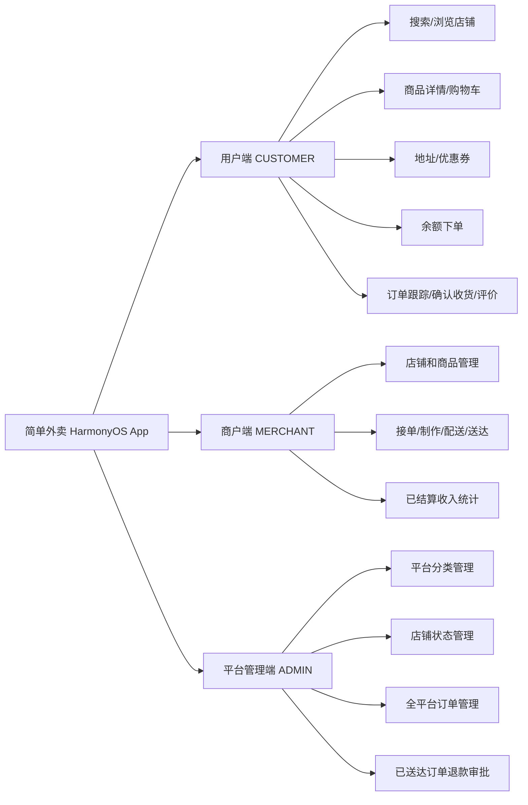
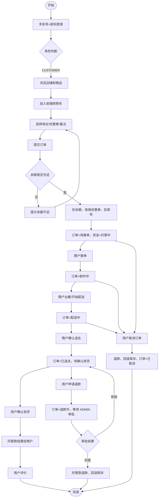
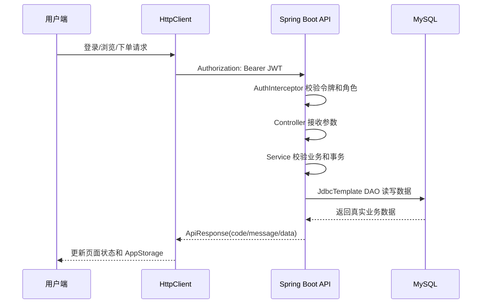
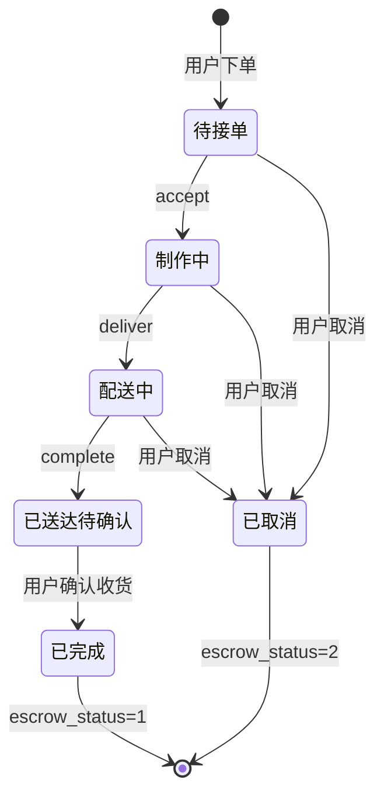
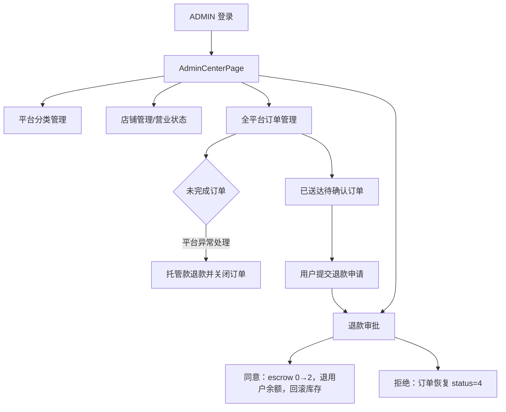

# 简单外卖业务流程落地说明

> 本文根据《苍穹外卖项目总结》的业务功能图、整体流程图和订单相关流程图重新整理，落地为本项目“简单外卖”的实际业务流程。
>
> 参考文章：<https://blog.csdn.net/Kaarina/article/details/132269877>
>
> 图示采用本项目原创 Mermaid 表达，不直接复制参考文章图片。所有接口、状态和角色均以当前仓库实现为准。

## 1. 与苍穹外卖的适配原则

苍穹外卖的流程图可以作为业务分析参考，但不能直接照搬到本项目。简单外卖的实现边界如下：

### 1.1 后续开发决策

- 参考文章作为后续业务流程和产品目标的主要依据。
- 当前仓库已有能力可以直接承载的流程，按现有实现继续完善。
- 超出现有代码、数据表、角色、接口或第三方依赖能力的流程，先记录为“待开发”，暂不擅自实现。
- 需要新增角色、数据表、支付方式、消息通道或外部服务时，先列出与现状的冲突和改造范围，再单独确认开发。
- 当前实现与文章流程不一致时，文档同时标注“目标流程”和“当前状态”，避免把未开发能力误认为已上线能力。

| 参考流程 | 简单外卖落地方式 |
| --- | --- |
| 用户端浏览、购物车、下单、支付、历史订单 | 保留；购物车为前端 AppStorage，余额支付在下单事务内完成 |
| 商家接单、出餐、配送、完成 | 保留；由商户端直接推进，不单独建设骑手端 |
| 骑手配送 | 当前不拆分骑手角色；商户“出餐”进入配送中，商户“确认送达”进入已送达待确认 |
| 微信小程序登录 | 改为手机号+密码登录，JWT 作为会话凭证 |
| 微信支付、支付回调、支付超时任务 | 当前不落地；下单时直接扣用户余额并进入平台托管 |
| Redis 店铺营业状态和菜品缓存 | 当前以 MySQL 实时查询为准，不新增 Redis 依赖 |
| WebSocket 来单提醒 | 当前以商户订单页刷新/重新查询为准，不新增 WebSocket |
| 套餐管理 | 当前数据模型没有套餐表，先按商品管理 |
| 平台员工管理 | 改为 ADMIN 独立后台，不展示 C 端主页、定位和购物车 |
| 报表导出 | 当前保留商户统计页面，不新增 Excel 导出 |

## 2. 角色与功能边界

登录后的入口必须按角色隔离：

- CUSTOMER 进入用户端首页和四个 Tab。
- MERCHANT 进入商户中心，只能操作自己店铺的数据。
- ADMIN 直接进入 `AdminCenterPage`，不得展示用户端主页、定位、购物车等功能。

## 3. 简单外卖整体业务流程

## 4. 用户端流程

用户下单的真实数据操作顺序：

1. 校验店铺营业状态、地址归属和商品归属。
2. 以数据库实时价格计算商品总价、配送费、优惠金额和实付金额。
3. 校验余额，扣减用户余额。
4. 核销优惠券并乐观扣减商品库存。
5. 写入订单和商品/地址 JSON 快照。
6. 订单状态设为 `1`，托管状态设为 `0`。
7. 店铺累计月销量加一。
8. 前端清除对应店铺购物车，刷新订单数据并进入订单详情页。

## 5. 商户端订单流程

商户操作权限必须同时满足：

- 当前登录角色为 `MERCHANT`。
- 订单所属店铺的 `owner_id` 等于当前商户。
- 当前订单状态符合对应操作的前置状态。

商户统计只统计 `status=4 且 escrow_status=1` 的订单；处于“已送达待确认”的订单属于待结算金额，不计入已结算营业额。

## 6. 平台管理端流程

ADMIN 不参与普通用户下单链路，也不替代商户执行接单、制作和配送操作。

## 7. 订单状态与资金状态

订单状态是业务流程主状态，`escrow_status` 是资金状态，二者必须联合展示：

| status | 含义 | 允许的主要操作 |
| ---: | --- | --- |
| 0 | 待付款（当前预留） | 当前余额下单不会停留在此状态 |
| 1 | 待接单 | 商户接单；用户取消并退款 |
| 2 | 制作中 | 商户出餐；用户取消并退款 |
| 3 | 配送中 | 商户确认送达；用户取消并退款 |
| 4 + escrow=0 | 已送达，待确认收货 | 用户确认收货或申请退款 |
| 4 + escrow=1 | 已完成 | 用户评价 |
| 5 | 已取消 | 查看历史订单 |
| 6 | 退款中 | 等待 ADMIN 审批 |

资金状态：

- `0`：托管中，用户已扣款，商户未到账。
- `1`：已结算，用户确认收货后商户到账。
- `2`：已退款，取消或退款审批同意后退回用户。

退款和结算都必须通过 `WHERE escrow_status=0` 的条件更新保证幂等；取消/退款只有在托管状态更新成功后才能回滚库存。

## 8. 参考文章流程与当前代码映射

| 流程节点 | 当前实现位置 |
| --- | --- |
| JWT 登录和接口认证 | `AuthController`、`JwtUtil`、`AuthInterceptor`、`WebConfig` |
| 用户浏览店铺和商品 | `StoreController`、`StoreService`、`Index.ets`、店铺详情页 |
| 购物车 | `CartPage.ets`、`AppStorageManager.ets`，前端本地持久化 |
| 结算下单 | `CheckoutPage.ets`、`OrderController`、`OrderService.createOrder` |
| 商户接单/出餐/送达 | `MerchantOrdersPage.ets`、`OrderService.merchantFlow` |
| 用户确认收货和资金结算 | `OrderService.confirmOrder` |
| 用户取消和即时退款 | `OrderService.cancelOrder` |
| 已送达退款审批 | `AdminRefundPage.ets`、`AdminService.approveRefund/rejectRefund` |
| 用户评价 | `ReviewPage.ets`、`OrderService.reviewOrder` |
| 商户统计 | `MerchantStatsPage.ets`、`OrderService.merchantStats` |
| ADMIN 平台管理 | `AdminCenterPage.ets` 及四个管理子页面 |

## 9. 当前明确不落地的参考能力

以下能力在参考文章中出现，但不属于当前简单外卖版本，未经单独批准不得新增：

- 微信小程序登录、微信支付和支付回调。
- Redis 缓存、分布式锁和缓存一致性方案。
- WebSocket 来单提醒和催单推送。
- Spring Task 支付超时扫描。
- 骑手独立端、实时骑手定位和配送轨迹服务。
- 套餐/套餐明细独立数据模型。
- OSS 图片上传、Excel 报表导出。
- `order_item`、`payment_record`、`user_coupon`、`order_status_log` 等目标演进表。

这些项目属于后续演进方向，不改变当前简单外卖的可运行闭环。

## 10. 验收闭环

- [ ] CUSTOMER 登录后能浏览真实店铺和商品。
- [ ] CUSTOMER 能加入购物车、选择地址和优惠券并余额下单。
- [ ] 下单后订单进入待接单，库存和余额同步变化。
- [ ] MERCHANT 只能看到自己店铺订单，并完成接单→制作→配送→送达。
- [ ] CUSTOMER 确认收货后托管款只结算一次。
- [ ] CUSTOMER 在未完成前取消时只退款一次并恢复库存。
- [ ] 已送达订单可以申请退款，ADMIN 能同意或拒绝。
- [ ] 已结算订单可以评价，重复评价被拒绝。
- [x] ADMIN 登录后只进入独立管理后台。
- [x] ADMIN 可管理员工账号、用户/商户账号状态、平台商品上下架与删除。
- [x] ADMIN 可查看平台用户、商户、店铺、商品、订单、成交金额、托管金额和热销商品统计。
